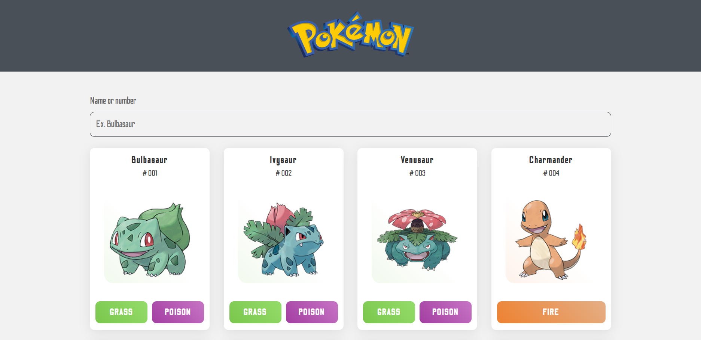

# Interface of Pokemon Application



# Pokemon Application React

# Demo

[Pokemon Application - Live ◀️](https://pokemon-dhyan110.netlify.app/)

## Project setup

### Clone this repo

```
https://github.com/dhyanpatel110/pokemon.git
```

### Install All Packages

```
npm install
```

### Compiles and hot-reloads for development

```
npm run start
```

### Compiles and minifies for production

```
npm run build
```

### Lints and fixes files

```
npm run lint
```
